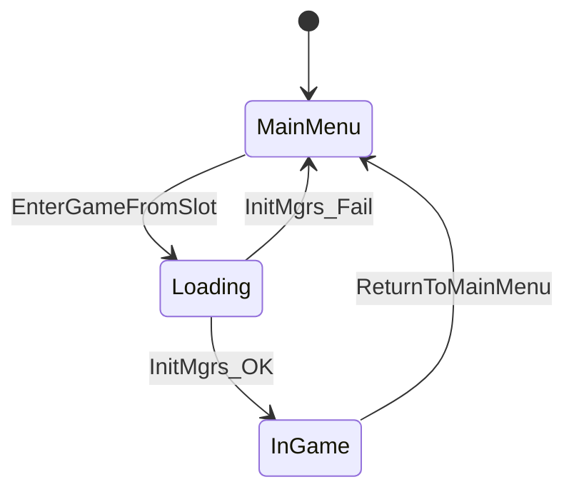

上级目录：[[文档]]

# 存档系统流程

> 对应 Phase A 实现。主库 `EVEdata.sqlite` 存静态数据 + `saveSlots` 表；每个存档为独立 `.save` 文件，运行时 ATTACH 为别名 `dyn`。

## 状态机

| 状态 | 说明 |
|------|------|
| `MainMenu` | 未 ATTACH 存档；显示 MainScene |
| `Loading` | 正在 load + Init Mgr（可选，失败回主菜单） |
| `InGame` | 已 ATTACH dyn；驱动 SolarSystemMgr / TaskMgr |

## 进入游戏：`EnterGameFromSlot(slotID)`

1. `SaveGameManager::loadSaveBySlotID(slotID)`
   - 查 `saveSlots.fileName`（`isDeleted = 0`）
   - `ATTACH DATABASE '...' AS dyn`
   - `CreateDynViewsIfNotExists` — 主库视图 `dynGameObjects` 等 → `dyn.dynGameObjects`
   - `updateLastPlayedTime(slotID)`
2. `AttributeMgr::Init()`
3. `SolarSystemMgr::Init()` → `setCurrentPilot()`
4. `TaskMgr` 注册 system handlers + `HandlerFactory::initializeHandlers()`
5. `GameState = InGame`，切换 `SpaceScene`

## 新建游戏：`StartNewGame()`

1. `createNewSaveFromTemplate("save/initial", ...)` — 复制模板到 `save/save_YYYYMMDD_HHMMSS.save`，写入 `saveSlots`
2. `EnterGameFromSlot(newSlotID)`

## 返回主菜单：`ReturnToMainMenu()`

1. `SaveGameManager::detachCurrentSaveDatabase()` — `DETACH dyn`
2. `SolarSystemMgr::Shutdown()` — 清空太阳系、Pilot、对象表、task handlers
3. `TaskMgr::ResetRuntime()` — 清空任务栈与 system handlers
4. `WindowManager::Reset()` — 清空游戏内浮窗
5. `GameState = MainMenu`，切换 `MainScene`

## SaveGameManager API

| 方法 | 说明 |
|------|------|
| `attachSaveDatabase(path)` | ATTACH 为 `dyn` |
| `detachCurrentSaveDatabase()` | DETACH |
| `loadSaveBySlotID(id)` | 按槽位加载 |
| `listSaveSlots()` | 列表 |
| `createNewSaveFromTemplate` | 从 `save/initial` 复制新建 |
| `getSaveSlotInfo(id)` | 单槽查询 |
| `updateLastPlayedTime(id)` | 更新最后游玩时间 |
| `deleteSaveSlot(id)` | 软删 `isDeleted=1` |

**持久化**：ATTACH 下对 `dyn*` 视图的写入直接落到 `.save` 文件，无需额外 flush（WAL 由 SQLite 管理）。

## 模板与路径

- 新建模板：`save/initial`（必须存在，否则 `createNewSaveFromTemplate` ERROR）
- 新档文件：`save/save_*.save`
- `fileName` 存相对路径，如 `save/save_20251116_205359.save`

## 历史断点（64448a8 半成品，已由 Phase A 修复）

- [x] MainScene 无 UI 入口 → A.4 临时按钮 / Phase C UIF
- [x] 仅 `StartNewGame`，无读档统一入口 → `EnterGameFromSlot`
- [x] 无回主菜单 teardown → `ReturnToMainMenu`

## 手动回归清单（A.5）

- [ ] MainScene →「开始新游戏」或 Enter → SpaceScene
- [ ] 游戏中 F10 → 回 MainScene
- [ ] 再点「开始新游戏」→ 新 slot，不串档
- [ ] 删除 `save/initial` 后新建 → 日志 `template file not found`
- [ ] `saveSlots.lastPlayedTime` 在加载后更新
