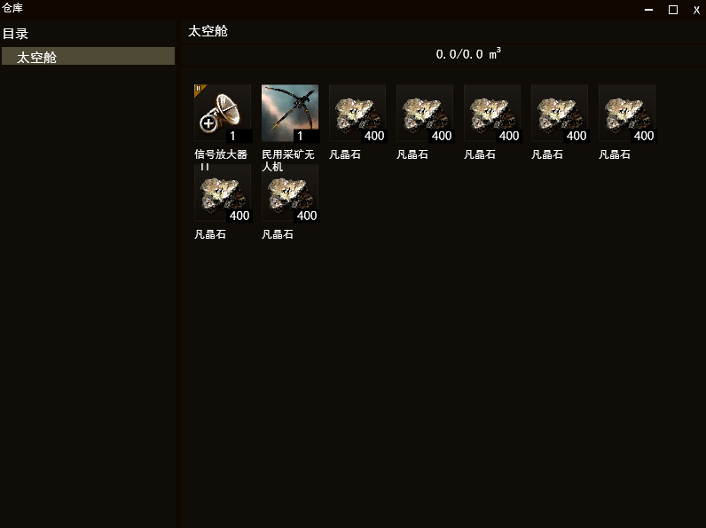
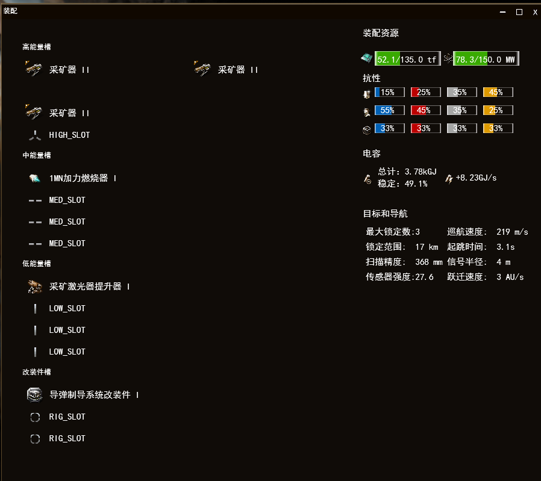
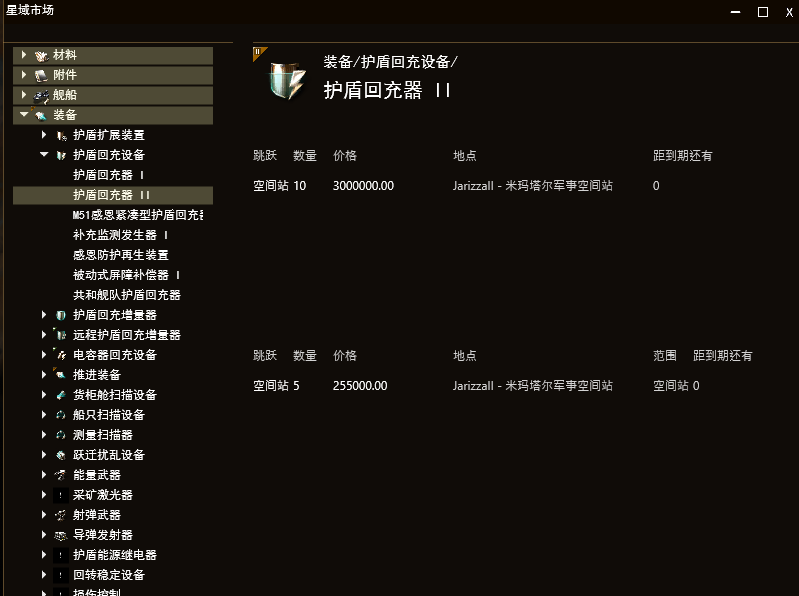
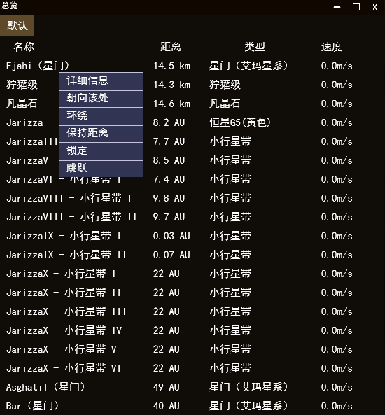
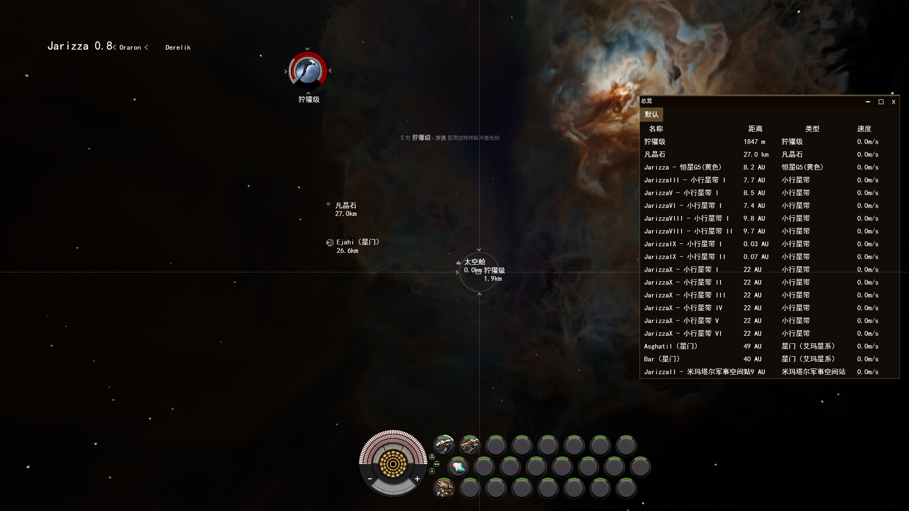

**项目背景**

本宇宙沙盒类游戏的开发源于个人对宇宙探索题材的浓厚兴趣。在众多宇宙游戏中，《Eve Online》凭借其丰富的玩法和宏大的宇宙设定，展现出巨大的魅力。然而，目前市场上的宇宙沙盒游戏仍存在一些可提升的空间，如性能优化、玩法的创新性等。因此，我们希望开发一款既具有高度自由和丰富玩法，又在性能和创新性上有所突破的宇宙沙盒游戏。

**功能介绍**

目前，游戏已实现了多个基础功能。玩家可以查看飞船仓库，管理自己的飞船资源，了解每一艘飞船的状态和属性。星图系统为玩家提供了广阔宇宙的概览，玩家能够在星图上规划航行路线，进行跃迁操作，利用星门快速穿越不同星系，探索宇宙的各个角落。飞船装配和总览功能允许玩家根据自己的战术需求，对飞船进行个性化的装配和调整。此外，玩家还可以进行进站出站操作，在空间站中补充资源、修理飞船等。游戏中也实现了基本的挖矿和战斗功能，玩家可以在宇宙中采集资源，也能与其他玩家或 NPC 进行战斗。

仓库

展示当前舰船的仓库情况，可以拖动物品到其它窗口来进行物品移动和配装等操作

装配

为当前的舰船调整装备并预览装配后的性能

市场

进行买入和卖出等操作

总览

展示处于同一空间中的其它实体，右键可以选择进行接近，跃迁至，锁定，对空间站可以选择停靠，对星门可以选择跳跃等交互和操作
其中跃迁至需要目标处于150km外，锁定需要目标处于舰船的锁定范围内（如10km），停靠等交互需要接近可交互实体2500m内。

舰船UI

已锁定的目标显示在屏幕中间偏上，同时空间中对应被锁定物体的图标会套上十字锁定框
下方的白色半圆弧代表护盾，装甲，结构血量，
黄色光点代表舰船电容电量
右方是舰船装备的主动装备（从上往下为高能量槽，中能量槽，低能量槽），启动的装备会有白色进度条指示运转进度

**开发环境与技术栈**

我们的开发环境基于 Windows 11 操作系统，使用 Visual Studio 2022 作为集成开发环境。游戏引擎完全使用 C++ 配合 DirectX 11 进行开发，DirectX 11 提供了强大的图形渲染和硬件加速功能，确保游戏能够在较低硬件要求下实现高质量的画面效果。此外，项目还集成了 nlohmann 的 JSON 库，用于加载生成处理数据的职责链的配置文件。天空盒纹理使用 Blender 进行生成。

**系统设计：**

一、系统架构总览

本游戏系统围绕基于 DirectX 11 及 C++ 开发的核心框架构建，从依赖图中可看出各模块间紧密关联，以实现丰富的宇宙沙盒游戏功能。整体架构涵盖图形渲染、输入处理、任务管理、组件系统、数据库管理以及用户界面等多个关键部分，各部分协同运作，支撑起游戏的运行。

二、核心模块详细设计

（一）图形渲染相关

Effect Component 及相关：Effect Component 用于管理渲染特效相关逻辑，不同的 xxxEffectComponent 实现特定的渲染特效功能，如着色器、渲染状态等。Effect对象可以挂载不同的Effect Component来实现多样化的渲染效果如天空盒，UI控件等。

RenderProxy：作为渲染代理，负责将游戏对象（GameObject）及其相关组件的渲染需求转化为 DirectX 11 可执行的渲染指令。它接收来自 GameObject、Camera 等模块的信息，根据场景布局和对象状态进行渲染操作，协调图形渲染流程，保证画面的正确输出。

（二）输入与任务管理

Mouse/Key 与 d3dApp.h：Mouse/Key 模块负责捕获鼠标和键盘输入事件，将用户的操作转化为游戏可识别的输入信号。d3dApp.h 则作为应用层与 DirectX 11 的交互桥梁，接收输入信号并传递给后续处理逻辑，同时负责游戏主循环等基本应用逻辑的管理。

Task 与 Component：Task 模块用于定义和管理游戏中的各种任务，如定时任务、异步任务等。Component 模块则是游戏对象的功能组件集合，不同的 xxxComponent 为 GameObject 赋予特定行为，如移动、装配等。两者相互配合，使游戏对象能按照预设逻辑执行任务，丰富游戏玩法。

（三）游戏对象与场景管理

GameObject 及其派生类：GameObject 是游戏中所有实体的基类，通过挂载不同的 xxxComponent 组件实现多样化功能。xxxGameObject 作为派生类，可针对特定游戏对象类型进行定制扩展，满足如飞船、星球等不同对象的独特需求。

Camera.h 与 Scene.h 及其派生类：Camera.h 负责管理游戏视角，定义相机的位置、朝向、视野范围等参数，决定玩家在游戏中的观察视角。Scene.h 及其派生类 xxxScene.h 用于管理游戏场景，包括场景中游戏对象的创建、销毁、位置更新等操作，以及场景相关资源的加载与释放，构建起游戏的虚拟世界框架。

（四）数据库与用户界面

DatabaseManager：基于 singletonBase 单例模式实现，负责游戏数据的存储与管理，如玩家角色信息、飞船属性、资源数据等。通过与其他模块交互，确保数据的正确读写和更新，为游戏的持续性和稳定性提供支持。

UI 相关（UIBase、UIxxx、UIWindow 及 UIWindowXXX）：UIBase 作为用户界面的基类，定义了通用的界面元素属性和行为。UIxxx 和 UIWindow 等派生类用于构建具体的用户界面窗口和控件，如菜单、信息提示框等。

三、系统设计优势与可扩展性

（一）优势

模块化设计：各功能模块职责明确，如渲染、输入、数据管理等模块相互独立又紧密协作，降低了系统复杂度，便于开发、调试和维护。

可复用性高：以 Component 为代表的组件化设计，使得游戏对象的功能可复用，提高开发效率，同时也便于新功能的添加和旧功能的修改。

（二）可扩展性

接口预留：各模块间通过清晰定义的接口进行交互，为未来添加新功能预留了扩展空间。例如，在 GameObject 添加新组件，或在 Scene 中引入新的场景元素类型时，只需遵循现有接口规范即可实现。

分层架构：从底层的图形渲染到上层的用户界面，采用分层架构设计，新的功能层可以在不影响底层核心逻辑的情况下进行添加或替换，有利于游戏的长期迭代和升级。

三、详细功能介绍

（一）星图系统

星图系统是玩家探索宇宙的核心工具。玩家进入游戏后，可通过特定操作（如点击主界面星图按钮）打开星图界面。星图以可视化形式呈现宇宙中星系分布，玩家能通过鼠标滚轮或缩放按钮对星图进行缩放操作，以便查看不同尺度下的宇宙布局。

（二）飞船系统

飞船仓库：玩家可随时打开飞船仓库界面，查看当前拥有的货物和弹药等。

飞船装配：进入飞船装配界面，玩家可看到飞船各部位插槽，分为高能量槽、中能量槽、低能量槽等。高能量槽适合安装武器类装备，如激光炮、导弹发射器等；中能量槽可装配护盾增强器、电子干扰设备等；低能量槽则可安装装甲板、推进器升级模块等。玩家从仓库中选择合适装备拖放到对应插槽即可完成装配。同时，系统会实时显示装配后飞船各项性能变化，如伤害输出、护盾强度、速度提升等数值，方便玩家调整装配方案，打造出符合自身战术需求的飞船。

（三）采集系统

玩家驾驶配备挖矿设备的飞船进入存在矿石资源的小行星带（可通过星图查看资源分布信息）。在挖矿界面（可通过飞船操作面板进入），玩家可看到周围可采集的矿石种类及储量提示。玩家操控飞船靠近矿石，打开对应采掘装备开始采集。不同矿枪对不同矿石采集效率不同，高级矿枪可采集更稀有矿石且采集速度更快。采集到的矿石可带回空间站进行售卖或用于熔炼后制造其他物品。

（四）空间站系统

进站出站：当玩家驾驶飞船靠近空间站2500m时，可在飞船操作界面点击 “进站” 按钮。系统会自动引导飞船进入空间站停靠区域。进站后，玩家可在空间站内进行一系列操作，如交易、修理飞船、补充燃料等。当玩家准备离开空间站时，点击 “出站” 按钮，飞船会离开空间站，重新进入宇宙空间。

使用文档

软件：需确保系统安装了必要的运行库和驱动程序，如 Visual Studio 2022 相关运行库、显卡最新驱动等。若在游戏启动时提示缺少某些 dll 文件，需根据提示安装对应的运行库。

游戏启动与关闭

启动：在游戏安装目录中，找到游戏可执行文件，双击即可启动游戏。

关闭：在游戏过程中，若要关闭游戏，可使用快捷键 alt + F4 。

游戏操作指引

视角与移动：使用 WASD 键控制飞船视角移动，实现空间中的位置调整。配合鼠标右键按住并移动，可旋转视角，全方位观察宇宙场景。

资源收集：锁定小行星后打开对应采掘装备开始收集矿物。

飞船装备：利用 F1 - F8、shift + F1 - F8、ctrl + shift + F1 - F8 快捷键组合，启停飞船各类装备。在战斗或任务中，可根据实际情况灵活切换装备状态。

界面操作：在总览界面，右键点击唤出右键菜单进行目标相关操作。在其他界面，依据界面提示和上述提到的操作方式，使用鼠标和快捷键完成相应功能操作。

快捷键：
c - 仓库界面
x - 装配界面
m - 星图界面
num1 - 市场界面

